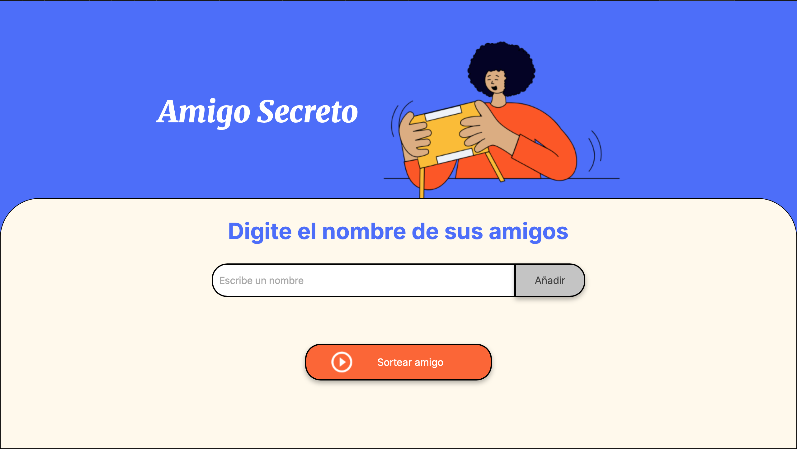
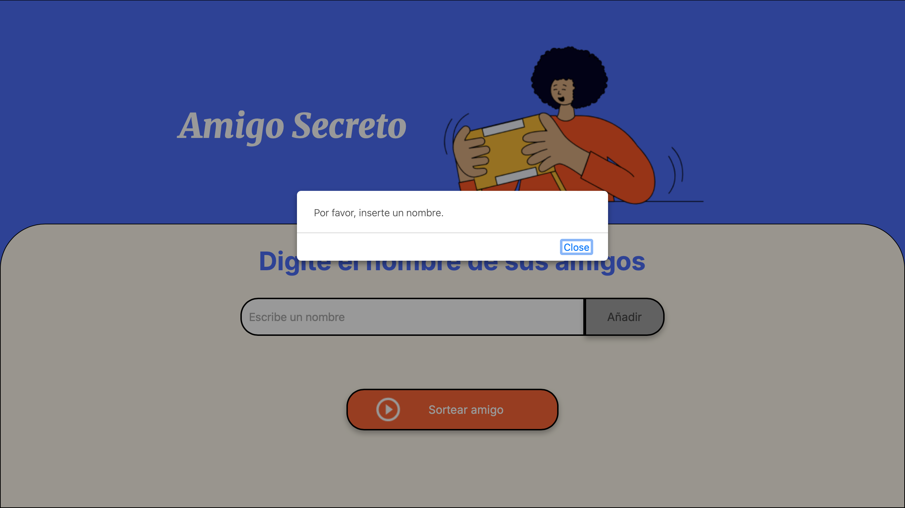
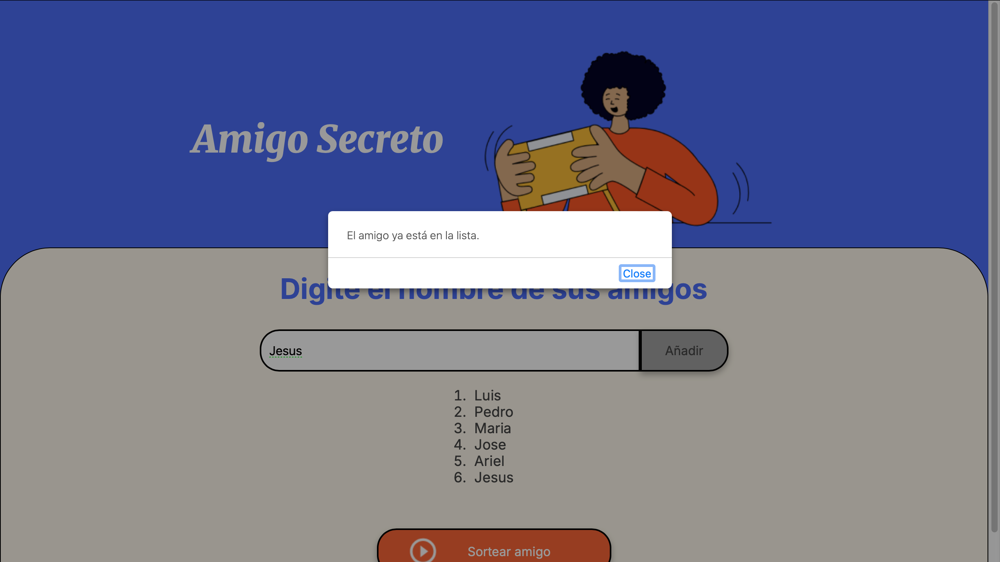
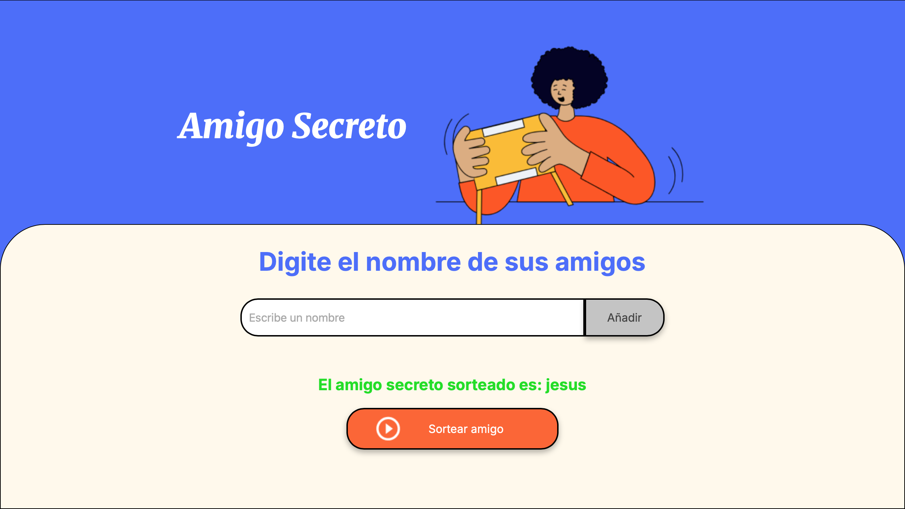

<h1 align="center"> Challenge Amigo Secreto </h1>

# README

El codigo presente en el archivo `app.js` permite el uso de la pagina `index.html` en la cual permite seleccionar  de forma aleatoria un nombre de la lista de nombres agregados.

## Descripción

`app.js` es el punto de entrada de la aplicación. Aquí se gestionan las funcionalidades principales, como la inicialización, manejo de eventos y lógica de negocio.

## Uso

* Para utilizar este programa es necesario abrir la ventana `index.html`, en la cual se observara la siguiente pantalla:

*Es necesario escribir un nombre para poder agregarlo, sino se presenta el siguiente mensaje:

*Si el programa detecta un nombre repetido, muestra la siguiente alerta.

Ademas, el nombre no es agregado a la lista.

*Finalmente, cuando se le da al botón sortear amigo, el programa selecciona aleatoriamente un nombre entre la lista y limpia la lissta de amigos introducida hasta el momento.

se puede introducir nuevos nombres para realizar un nuevo sorteo.

## Autor

Ariel Almaguer
